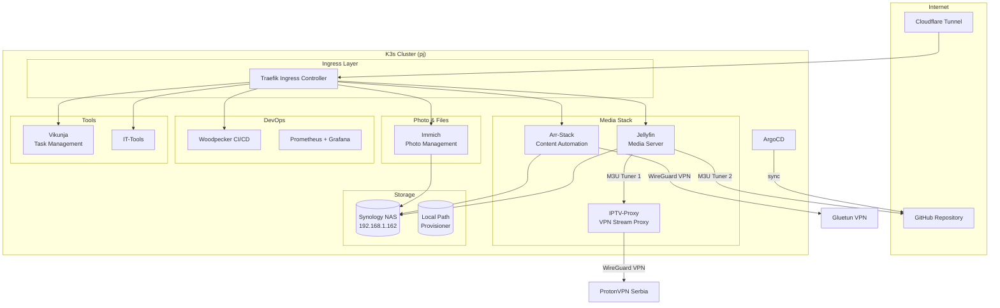
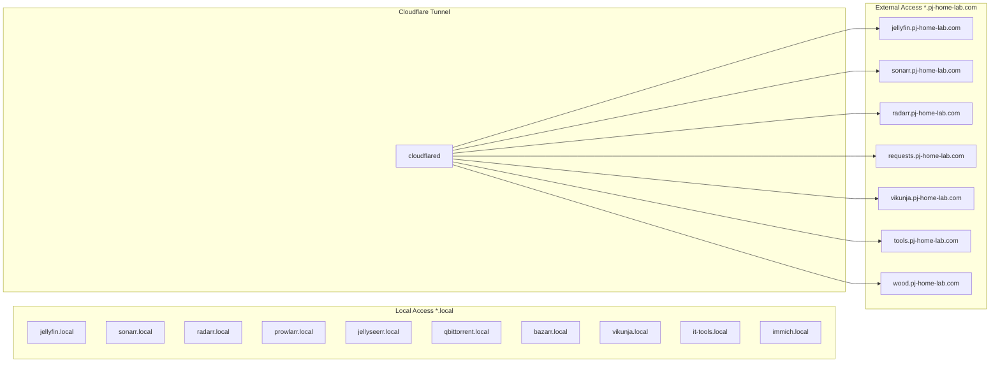
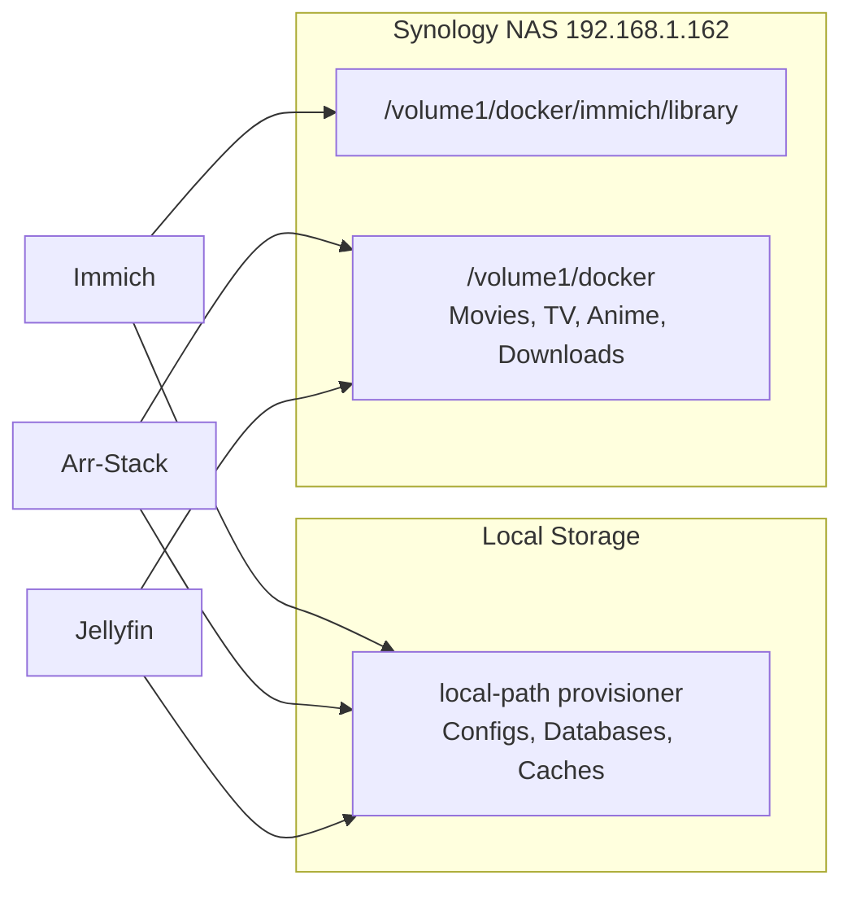

# Home Lab Kubernetes Cluster

GitOps-managed K3s cluster running on a single node in Vienna, Austria. All applications are deployed and synced via **ArgoCD** from this repository.

## Architecture



## Network Overview



## Applications

| App | Namespace | Description | Local URL | External URL |
|-----|-----------|-------------|-----------|-------------|
| [Jellyfin](apps/jellyfin/) | `jellyfin` | Media server with Live TV (IPTV) | jellyfin.local | jellyfin.pj-home-lab.com |
| [Arr-Stack](apps/arr-stack/) | `arr-stack` | Content automation (Sonarr, Radarr, etc.) | sonarr.local | sonarr.pj-home-lab.com |
| [Immich](apps/immich/) | `immich` | Photo management | immich.local | - |
| [Monitoring](apps/monitoring/) | `monitoring` | Prometheus + Grafana | /grafana | - |
| [Vikunja](apps/vikunja/) | `vikunja` | Task management | vikunja.local | vikunja.pj-home-lab.com |
| [Woodpecker](apps/woodpecker/) | `woodpecker` | CI/CD pipeline | - | wood.pj-home-lab.com |
| [IT-Tools](apps/it-tools/) | `it-tools` | IT utilities | it-tools.local | tools.pj-home-lab.com |
| [Cloudflare](apps/cloudflare/) | `cloudflare` | Tunnel for external access | - | - |

### External Repos

| App | Repo | Description |
|-----|------|-------------|
| [IPTV-Proxy](https://github.com/Petar-Jorgic/iptv-playlists) | `iptv-proxy` (local build) | WireGuard VPN proxy for Serbian IPTV streams |

## Storage



| Storage Class | Type | Path | Used By |
|---------------|------|------|---------|
| `nfs-immich` | NFS | `/volume1/docker/immich/library` | Immich (200Gi) |
| `nfs-jellyfin` | NFS | `/volume1/docker` | Jellyfin (500Gi) |
| `nfs-arr` | NFS | `/volume1/docker` | Arr-Stack (32Ti) |
| `local-path` | Local | Node storage | All configs/DBs |

## GitOps with ArgoCD

This cluster uses the **App of Apps** pattern:

```
root-app.yaml          -> Points to argocd/
argocd/
  kustomization.yaml   -> Lists all ArgoCD Application manifests
  base.yaml            -> Namespaces, limits, storage
  secrets.yaml         -> Sealed secrets
  jellyfin.yaml        -> apps/jellyfin/
  arr-stack.yaml       -> apps/arr-stack/
  immich.yaml          -> apps/immich/
  monitoring.yaml      -> apps/monitoring/
  vikunja.yaml         -> apps/vikunja/
  woodpecker.yaml      -> apps/woodpecker/
  it-tools.yaml        -> apps/it-tools/
  cloudflare.yaml      -> apps/cloudflare/
```

All applications have **automated sync**, **prune**, and **self-heal** enabled.

## Secrets Management

Secrets are managed with **Sealed Secrets**. Sealed secrets are safe to commit to git - only the cluster can decrypt them.

## Default Resource Limits

Applied cluster-wide via LimitRange:

| | Requests | Limits |
|---|----------|--------|
| CPU | 100m | 500m |
| Memory | 256Mi | 1Gi |
