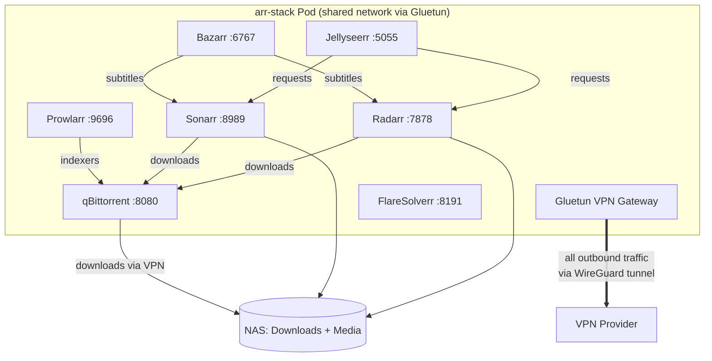

# Arr-Stack

Content automation suite running as a multi-container pod behind a VPN tunnel (Gluetun).

## Architecture

> All containers share the same network namespace. Gluetun controls all outbound traffic through a WireGuard tunnel - including qBittorrent downloads.

## Components

| Service | Image | Port | Ingress |
|---------|-------|------|---------|
| Gluetun | `qmcgaw/gluetun` | - | - |
| qBittorrent | `linuxserver/qbittorrent` | 8080 | qbittorrent.local |
| Sonarr | `linuxserver/sonarr` | 8989 | sonarr.local / sonarr.pj-home-lab.com |
| Radarr | `linuxserver/radarr` | 7878 | radarr.local / radarr.pj-home-lab.com |
| Prowlarr | `linuxserver/prowlarr` | 9696 | prowlarr.local / prowlarr.pj-home-lab.com |
| Jellyseerr | `fallenbagel/jellyseerr` | 5055 | jellyseerr.local / requests.pj-home-lab.com |
| Bazarr | `linuxserver/bazarr` | 6767 | bazarr.local / bazarr.pj-home-lab.com |
| FlareSolverr | `ghcr.io/flaresolverr/flaresolverr` | 8191 | - |

## Storage

- **Config**: 10Gi (local-path)
- **Downloads**: 100Gi (local-path)
- **Media**: 32Ti (NFS from Synology NAS)

## Deployment Strategy

`Recreate` - all containers share a single pod for network access through Gluetun VPN.
