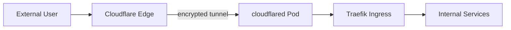

# Cloudflare Tunnel

Outbound tunnel to Cloudflare for secure external access without exposing cluster ports.

## How it works

## Details

| | |
|---|---|
| Image | `cloudflare/cloudflared:latest` |
| Command | `tunnel --no-autoupdate run` |
| Token | From sealed secret `cloudflare-tunnel-token` |
| Resources | 100-500m CPU, 64-128Mi Memory |

## Exposed Services

All `*.pj-home-lab.com` domains route through this tunnel.
