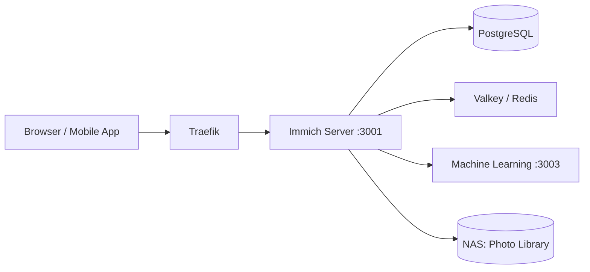

# Immich

Self-hosted photo and video management platform.

## Architecture

## Deployment

Helm chart: `immich v0.10.3` from `immich-app.github.io/immich-charts`

## Components

| Component | Details |
|-----------|---------|
| Server | Main API + Web UI |
| PostgreSQL | Metadata database (10Gi) |
| Valkey | Cache / Redis replacement (1Gi) |
| Machine Learning | Face recognition, search (500m-2 CPU, 512Mi-2Gi) |

## Storage

- **Photo Library**: 200Gi (NFS from Synology NAS)
- **ML Cache**: 10Gi (local-path)
- **Database**: 10Gi (local-path)

## Ingress

- `immich.local`
