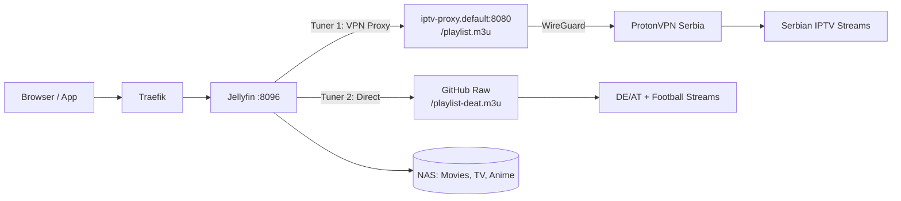

# Jellyfin

Media server with Live TV support via IPTV proxy.

## Architecture

## Live TV Tuners

| Tuner | URL | Content | Via VPN |
|-------|-----|---------|---------|
| 1 | `http://iptv-proxy.default:8080/playlist.m3u` | 16 Serbian channels | Yes (Serbia) |
| 2 | `https://raw.githubusercontent.com/.../playlist-deat.m3u` | 27 DE/AT + 3 Football | No (direct) |

## Resources

| | Requests | Limits |
|---|----------|--------|
| CPU | 500m | 4000m |
| Memory | 1Gi | 4Gi |

## Storage

- **Config**: 10Gi (local-path)
- **Media**: 500Gi (NFS from Synology NAS)
- **Cache**: emptyDir

## Ingress

- `jellyfin.local`
- `jellyfin.pj-home-lab.com`
